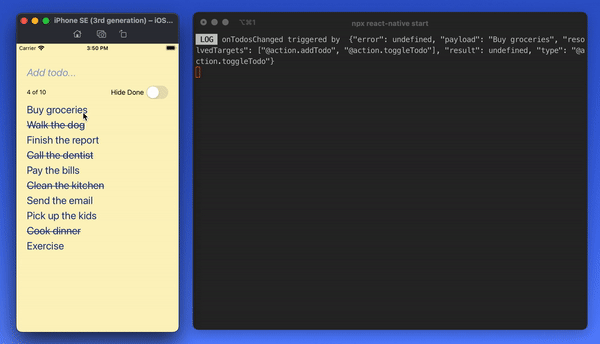

React Native Todo app based on React Native CLI quick start

Store model copied (and modified) from [simple-todo](../simple-todo)



## Getting Started

> Ensure that you have a working [development environment](https://reactnative.dev/docs/environment-setup?guide=native).

First, install the dependencies:

```bash
yarn
```

iOS

```bash
yarn ios
```

Android

```bash
yarn android
```

If metro does not start automatically, run:

```bash
npx react-native start
```

You can start editing the screen by modifying `src/components/TodoList.tsx`.

The `easy-peasy` store & models are located under `src/store`.
The `App.tsx` file wraps the `<TodoList />` component with the `<StoreProvider>`.

Happy coding! 🍏
