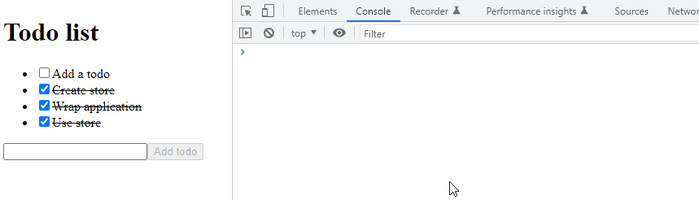

# Simple todo example

The simplest example of `react` and `easy-peasy`.

Start the app by running `yarn dev`.

Project template: [Vite + React + Typescript + Eslint + Prettier](https://github.com/TheSwordBreaker/vite-reactts-eslint-prettier).
