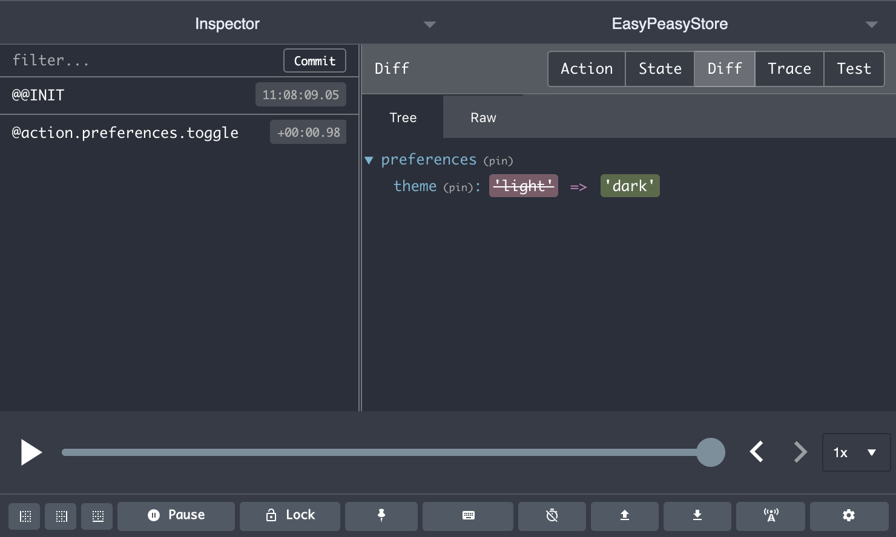

# action

Allows you to declare an [action](/docs/api/action.html) on your model. An
[action](/docs/api/action.html) is used to perform updates on your
[store](/docs/api/store.html).

```javascript
addTodo: action((state, payload) => {
  state.items.push(payload);
});
```

You can mutate the state directly within an action to update your store -
mutations are turned into immutable updates against your store via
[`immer`](https://immerjs.github.io/immer/docs/introduction).

When you dispatch an [action](/docs/api/action.html) it will be executed
synchronously in order to update your store.

- [API](#api)
  - [Arguments](#arguments)
- [Tutorial](#tutorial)
  - [Debugging Actions](#debugging-actions)
  - [Using console.log within actions](#using-consolelog-within-actions)
- [Bad Practices](#bad-practices)
  - [1. Don't destructure the `state` argument](#1-dont-destructure-the-state-argument)
  - [2. Don't execute any side effects within your action](#2-dont-execute-any-side-effects-within-your-action)

## API

An `action` is a function that is described below.

### Arguments

- `handler` (Function, _required_)

  The handler for your [action](/docs/api/action.html). It will receive the
  following arguments:

  - `state` (Object)

    The part of the state tree that the [action](/docs/api/action.html) is bound
    against. You can mutate this state value directly as required by the
    [action](/docs/api/action.html). Under the hood we convert these mutations
    into an update against the Redux store.

  - `payload` (any)

    The payload, if any, that was provided to the
    [action](/docs/api/action.html) when it was dispatched.
  
  - `config` (Object)

    The config object that was provided to the
    [action](/docs/api/action.html) when it was dispatched. 
    - `immer` (Boolean)
      Whether to use `immer` to update the state. Defaults to `true`.

## Tutorial

### Debugging Actions

Ensure you have the
[Redux Dev Tools](https://github.com/zalmoxisus/redux-devtools-extension)
extension installed. This will allow you to see your dispatched actions, with
their payload and the effect that they had on your state.



### Using console.log within actions

Despite the Redux Dev Tools extension being available there may be cases in
which you would like to perform a `console.log` within the body of your
[actions](/docs/api/action.html) to aid debugging.

If you try to do so you may note that a `Proxy` object is printed out instead of
your expected state. This is due to us using `immer` under the hood, which
allows us to track mutation updates to the state and then convert them to
immutable updates.

To get around this you can use the [debug](/docs/api/debug.html) utility.

```javascript
import { debug } from 'easy-peasy';

const model = {
  myAction: action((state, payload) => {
    console.log(debug(state));
  }),
};
```

## Bad Practices

There are few important points to make in the context of actions.

### 1. Don't destructure the `state` argument

```javascript
action((state, payload) => {
  const { todos } = state;
  //       👆 destructuring the state argument is bad, m'kay
  todos.push(payload);
}),
```

_or_

```javascript
action(({ todos }, payload) => {
  //       👆 destructuring the state argument is bad, m'kay
  todos.push(payload);
}),
```

Doing this will break our ability to convert your code into an immutable update
and will result in your state not being updated.

> If you are interested in why this happens; it is because Immer uses
> [proxies](https://developer.mozilla.org/en-US/docs/Web/JavaScript/Reference/Global_Objects/Proxy)
> to track which state is being mutated/updated. Destructuring breaks out of the
> proxy, thereby removing this ability and will result in your state not being
> updated as expected.

### 2. Don't execute any side effects within your action

Actions should remain synchronous and pure. They should only perform state
updates and must not do things like making an API request.

```javascript
action(({ todos }, payload) => {
  // 👇 side effects in actions are bad, m'kay
  fetch('/todos').then(response => response.json()).then(data => {
    state.todos = state.todos.concat(data);
  });
}),
```

If you need to perform side effects then you should encapsulate them within a
Thunk, a concept we will introduce later in the tutorial.
