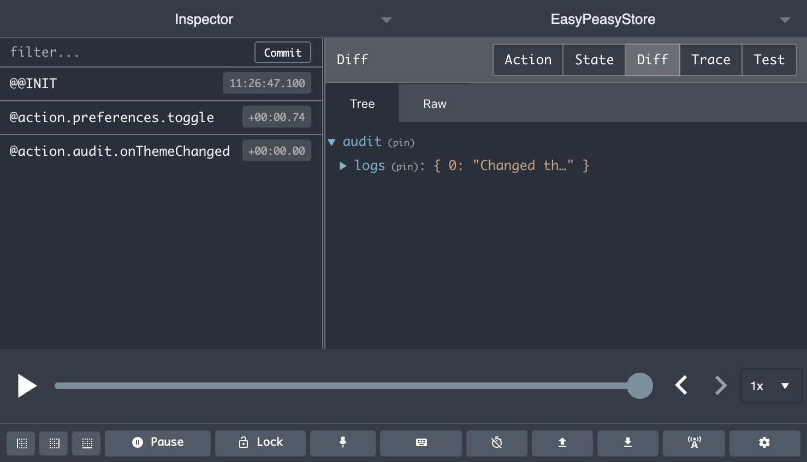

# action

Allows you to declare an [action](/docs/api/action) on your model. An [action](/docs/api/action) is used to perform updates on your [store](/docs/api/store).

```javascript
addTodo: action((state, payload) => {
  state.items.push(payload);
})
```

##  Arguments

  - `handler` (Function, *required*)

    The handler for your [action](/docs/api/action). It will receive the following arguments:

    - `state` (Object)

      The part of the state tree that the [action](/docs/api/action) is against. You can mutate this state value directly as required by the [action](/docs/api/action). Under the hood we convert these mutations into an update against the Redux store.

    - `payload` (any)

      The payload, if any, that was provided to the [action](/docs/api/action) when it was dispatched.

  - `options` (Object, *optional*)

    Additional configuration for the [action](/docs/api/action). It current supports the following
    properties:

    - `listenTo` ([action](/docs/api/action) reference | [thunk](/docs/api/thunk) reference | string | Array, *optional*)

      Setting this makes your [action](/docs/api/action) *listen* to provided *target(s)* [action(s)](/docs/api/action), [thunk(s)](/docs/api/thunk), or string named action(s). Any time the *target(s)* is successfully processed then this [action](/docs/api/action) will be fired.

      The *listener* will receive the same payload as was supplied to the *target(s)*.

      ```javascript
      const auditModel = {
        logs: [],
        onTodoAdded: action(
          (state, payload) => {
            state.logs.push(`Added todo: ${payload.text}`);
          },
          { listenTo: todosModel.addTodo }
        )
      };

      store.getActions().todos.addTodo({ text: 'Learn Easy Peasy' });
      ```

      This helps to promote a reactive model and allows for separation of concerns.

## Actions are synchronous

[Actions](/docs/api/action) are executed synchronously, therefore, you can immediately query your [store](/docs/api/store) to see the updated state.

```javascript
store.getActions().todos.addTodo('Learn Easy Peasy');

store.getState().todos.items;
// ["Learn Easy Peasy"]
```

## Debugging Actions

Ensure you have the [Redux Dev Tools](https://github.com/zalmoxisus/redux-devtools-extension) extension installed. This will allow you to see your dispatched actions, with their payload and the effect that they had on your state.


## Example

This example demonstrates how to both define an action and consume it from a React component.

```javascript
import { action, createStore, useStoreActions } from 'easy-peasy';

const store = createStore({
  total: 0,
  add: action((state, payload) => {
    state.total += payload;
  })
});

function Add10Button() {
  const add = useStoreActions(actions => actions.add);
  return <button onClick={() => add(10)}>Add 10</button>;
}
```

## Listener actions

It is possible to define an [action](/docs/api/action) as being a *listener* via the `listenTo` configuration property. A *listener* [action](/docs/api/action) will be fired every time that the *target* [action](/docs/api/action)/[thunk](/docs/api/thunk) successfully completes. The *listener* will receive the same payload that was provided to the *target*.

An example use case for this would be the need to clear some state when a user logs out of your application, or if you would like to create an audit trail for when certain [actions](/docs/api/action)/[thunks](/docs/api/thunk) are fired.

```javascript
const todosModel = {
  items: [],
  //  👇 the target action
  addTodo: action((state, payload) => {
    state.items.push(payload);
  })
};

const auditModel = {
  logs: [],
  // 👇 the listener
  onAddTodo: action(
    (state, payload) => {
      state.logs.push(`Added todo: ${payload.text}`);
    },
    { listenTo: todosModel.addTodo } // 👈 declare the target to listen to
  )
};
```

In the example above note that the `onAddTodo` [action](/docs/api/action) has been provided a configuration, with the `addTodo` [action](/docs/api/action) being set as a target.

Any time the `addTodo` [action](/docs/api/action) completes successfully, the `onAddTodo` will be fired, receiving the same payload as what `addTodo` received.

## Listening to multiple actions

It is possible for a *listening* action to listen to multiple *targets*. Simply provide an array of *targets* against the `listenTo` configuration.

```javascript
const fooModel = {
  items: [],
  //  👇 the first target action
  firstAction: action((state, payload) => {
    state.items.push(payload);
  }),
  // 👇 the second target action
  secondAction action((state, payload) => {
    state.items.push(payload);
  }),
};

const auditModel = {
  logs: [],
  onAddTodo: action(
    (state, payload) => {
      state.logs.push(payload);
    },
    {
      // 👇 declare the targets within an array
      listenTo: [
        fooModel.firstAction,
        fooModel.secondAction
      ]
    }
  )
};
```

## Debugging listeners

Listeners are visible within the [Redux Dev Tools](https://github.com/zalmoxisus/redux-devtools-extension) extension. This makes it very easy to validate they are executing as expected, and to see the effect that they had on state.

Below is an example of an [action](/docs/api/action) *listener* being fired in response to an action.



## Using console.log within actions

Despite the Redux Dev Tools extension being available there may be cases in which you would like to perform a `console.log` within the body of your [actions](/docs/api/action) to aid debugging.

If you try to do so you may not that a `Proxy` object is printed out instead of your expected state. This is due to us using `immer` under the hood, which allows us to track mutation updates to the state and then convert them to immutable updates.

To get around this you can use the [debug](/docs/api/debug) util.

```javascript
import { debug } from 'easy-peasy';

const model = {
  myAction: action((state, payload) => {
    console.log(debug(state));
  })
};
```