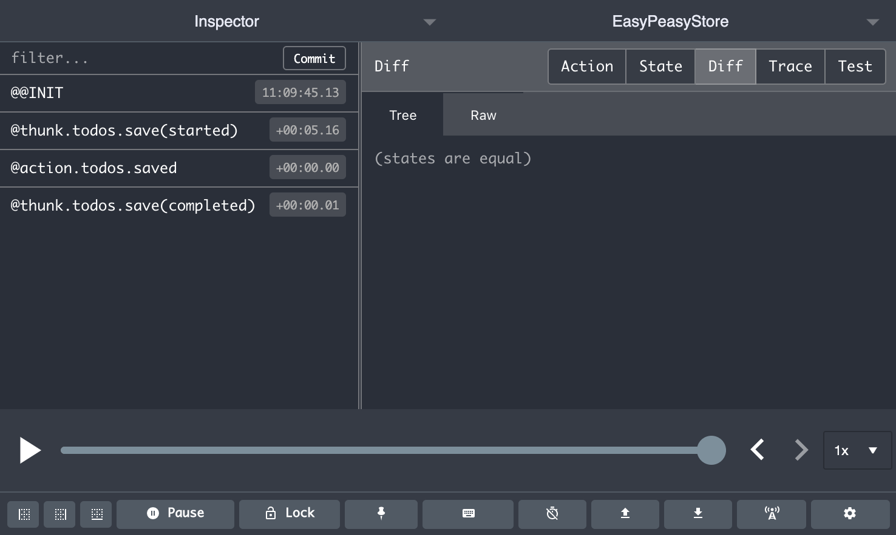

# thunk

Declares a thunk action on your model. A thunk typically encapsulates side effects (e.g. calls to an API). It is always executed asynchronously, returning a `Promise`. Thunks cannot modify state directly, however, they can dispatch other actions to do so.

```javascript
thunk(async (actions, payload) => {
  const user = await loginService(payload);
  actions.loginSucceeded(user);
})
```

## Arguments

  - `handler` (Function, *required*)

    The handler for your [thunk](/docs/api/thunk). It will receive the following arguments:

    - `actions` (Object)

      The [actions](/docs/api/action) that are local to the thunk. This allows you to dispatch an [action](/docs/api/action) to update state should you require.

    - `payload` (any)

      If a payload was provided to the thunk when it was dispatch it will be available via this argument.

    - `helpers` (Object)

      Helpers which may be useful for more advanced thunk implementations. It contains the following properties:

      - `dispatch` (Function)

        The Redux dispatch function, allowing you to dispatch "custom" actions.

      - `getState` (Function)

        When executed it will provide the state that is local to the thunk.

      - `getStoreActions` (Function)

        When executed it will get the [actions](/docs/api/action). i.e. all of the [actions](/docs/api/action) across your entire store.

        We don't recommend dispatching actions like this, and invite you to consider creating a *listener* [action](/docs/api/action) or [thunk](/docs/api/thunk), which instead promotes a reactive model and generally allows responsiblity to be at the right place.

      - `getStoreState` (Function)

        When executed it will provide the entire state of your store.

      - `injections` (Any, default=undefined)

        Any dependencies that were provided to the `createStore` configuration
        will be exposed via this argument. See the [`StoreConfig`](#storeconfig)
        documentation on how to provide them to your store.

      - `meta` (Object)

        This object contains meta information related to the thunk. Specifically it
        contains the following properties:

          - parent (Array)

            An array representing the path of the parent against which the thunk
            was attached within your model.

          - path (Array)

            An array representing the full path to the thunk based on where it
            was attached within your model.

        For example:

        ```javascript
        const store = createStore({
          products: {
            fetchById: thunk((actions, payload, { meta }) => {
              console.log(meta);
              // {
              //   parent: ['products'],
              //   path: ['products', 'fetchById']
              // }
            })
          }
        });
        ```
  - `options` (Object, *optional*)

    Additional configuration for the [thunk](/docs/api/thunk). It current supports the following
    properties:

    - `listenTo` (Function, *optional*)

      Setting this allows your [thunk](/docs/api/thunk) to act as a *listener*, automatically firing in response to the *target* actions that are resolved by your `listenTo` callback function.

      Please see the [listenTo](/docs/api/listen-to) documentation for full details on this configuration value.

## Thunks are asynchronous

There is an important distinction to be made of [thunks](/docs/api/thunk), when compared to [actions](/docs/api/action). [Thunks](/docs/api/thunk) are executed asynchronously, _always_ returning a `Promise`.

This is especially important in the cases that you would like to execute some code after the [thunk](/docs/api/thunk) has completed. In this case you would need to wait for the `Promise` that is returned to resolve.

For example, if you wanted to inspect the state changes that occurred after your [thunk](/docs/api/thunk) completed you would have to do the following.

```javascript
store.getActions().todos.saveTodo('Learn easy peasy')
  // 👇 we chain on the promise returned by dispatching the thunk
  .then(() => {
    console.log(store.getState());
  });
```

This mechanism is useful within your React components. For example you may use a [thunk](/docs/api/thunk) to handle a form submission (e.g. login), and then perform a redirect after the [thunk](/docs/api/thunk) has completed.

## Debugging Thunks

[Thunks](/docs/api/thunk) represent asynchronous execution that have no effect on state, however, we believed it would be useful to dispatch [actions](/docs/api/action) that represented the various states of a [thunk](/docs/api/thunk); *started*, *completed*, or *failed*. These dispatched actions have no effect on your state, however, they are still very useful.

Dispatching these actions results in the following benefits:

1. Increased debugging experience, with greater visibility of asynchronous flow of [thunks](/docs/api/thunk) in relation to your standard [actions](/docs/api/action) being dispatched
2. Enables listeners to be attached to specific [thunk](/docs/api/thunk) states (i.e. *started*, *completed*, or *failed*)

Using the [Redux Dev Tools](https://github.com/zalmoxisus/redux-devtools-extension) extension you will be able see your dispatched [thunks](/docs/api/thunk) as they flow through each of their states. You will also see the payload that was provided to the [thunk](/docs/api/thunk).



## Example

This is a fully integrated example show how you can declare and use a thunk.

```javascript
import { action, createStore, thunk, useStoreActions } from 'easy-peasy';

const store = createStore({
  session: {
    user: undefined,
    //  👇 our thunk
    login: thunk(async (actions, payload) => {
      const user = await loginService(payload)
      actions.loginSucceeded(user)
    }),
    loginSucceeded: action((state, payload) => {
      state.user = payload
    })
  }
});

function LoginButton({ username, password }) {
  const login = useStoreActions(actions => actions.session.login);
  return (
    //                       👇 dispatch with a payload
    <button onClick={() => login({ username, password }))}>
      Login
    </button>
  );
}
```

## Accessing local state

In this example our thunk will use the state that is local to it.

```javascript
import { createStore, thunk } from 'easy-peasy';

const store = createStore({
  counter: {
    count: 1,
    debug: thunk(async (actions, payload, { getState }) => {
      console.log(getState());
      // { count: 1 }
    }),
  }
});
```

## Accessing full store state

In this example our thunk will use the full state of our store.

```javascript
import { createStore, thunk } from 'easy-peasy';

const store = createStore({
  session: {
    username: 'mary',
  },
  counter: {
    count: 1,
    debug: thunk(async (actions, payload, { getStoreState }) => {
      const state = getStoreState();
      console.log(state);
      // { session: { username: 'mary' }, counter: { count: 1 } }
    }),
  }
});
```

## Dispatching an action on another part of your model

In this example we will dispatch an action that belongs to another part of your model.

```javascript
import { action, createStore, thunk } from 'easy-peasy';

const store = createStore({
  audit: {
    logs: [],
    add: action((state, payload) => {
      audit.logs.push(payload);
    })
  },
  todos: {                                     👇
    saveTodo: thunk((actions, payload, { getStoreActions }) => {
      getStoreActions().audit.add('Added a todo');
    })
  }
});
```

We don't recommend doing the above, and instead encourage you to define a listener [action](/docs/api/action) or [thunk](/docs/api/thunk), which promotes a better separation of concerns.

## Dependency injection

In this example we will use an injected util provided to our store via the store configuration.

```javascript
import { createStore, thunk } from 'easy-peasy';
import api from './api'

const model = {
  foo: 'bar',
  doSomething: thunk(async (dispatch, payload, { injections }) => {
    //                                              👆
    //                 |- Consuming the injections -|
    //                👇
    const { api } = injections
    await api.foo()
  }),
};

const store = createStore(model, {
  // 👇 injections defined here
  injections: {
    api,
  }
});
```