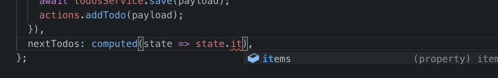

# Adding typed computed properties

Let's imagine a new requirement for our application, where we would like to display the next 3 todos on our list.

We could naively implement it like so.

```typescript
import { useStoreState } from './my-store';

export default function NextTodos() {
  const todos = useStoreState(state => state.todos.items);
  const nextThree = todos.slice(0, 3);
  return (
    <ul>
      {nextThree.map(todo => <li>{todo}</li>)}
    </ul>
  );
}
```

This is a form of derived state, where we are deriving new state within our component. The deriving operation will occur any time that our component re-renders, or when a new todo is added to our store.

Although this example looks fairly harmless, there may be cases where you the deriving process is an expensive operation. Alternatively you may have the need to display the next todos in many parts of your application, leading to duplication of the deriving logic.

For these cases we recommend that you define a [computed](/docs/api/computed) property to represent the derived state.

Easy Peasy exports a `Computed` type allowing you to declare a [computed](/docs/api/computed) on your model interface. The signature for this type is:

```typescript
Computed<
  Model,
  Result,
  ResolvedState,
  StoreModel
>
```

## Type parameters

As you can see the type accepts four type parameters. In almost every case you will most likely only need to provide the first two.

The type arguments can be described as follows.

- `Model`

  The model against which the [computed](/docs/api/computed) property is being bound.

- `Result`

  This allows you to declare the type of the data that will be returned by the [computed](/docs/api/computed) property.

- `ResolvedState`

  This type is only required if you are using `stateResolvers` within your [computed](/docs/api/computed) property. The next section will cover how to define these.

- `StoreModel`

  If your state resolvers will operate against global state you will need to provide your store's model interface so that the global state is typed correctly.

## Declaring a computed property

Let's extends our todos model interface to include a [computed](/docs/api/computed) property.

```typescript
import { Computed } from 'easy-peasy';
//         👆

export interface TodosModel {
  items: string[];
  addTodo: Action<TodosModel, string>;
  saveTodo: Thunk<TodosModel, string>;
  nextTodos: Computed<TodosModel, string[]>; // 👈 declaring our computed property
}
```

## Implementing a computed property

We can now implement our [computed](/docs/api/computed) property like so.

```typescript
import { computed } from 'easy-peasy';
//         👆

const todosModel: TodosModel = {
  items: [],
  addTodo: action((state, payload) => {
    state.items.push(payload);
  }),
  saveTodo: thunk(async (actions, payload) => {
    await todosService.save(payload);
    actions.addTodo(payload);
  }),
  // 👇 declaring our computed property
  nextTodos: computed(state => state.items.slice(0, 3))
};
```

Again, as we declared the `Computed` property against our model, Typescript would have been making sure that we implemented our [computed](/docs/api/computere) property per spec.

<div class="screenshot">
  
  <span class="caption">Typing info available during computed prop implementation</span>
</div>

## Accessing a computed property

Now let's go back to our `NextTodos` component and refactor it to use our [computed](/docs/api/computed) property.

```typescript
import { useStoreState } from '../store';

export default function NextTodos() {
  const todos = useStoreState(state => state.todos.nextTodos);
  return (
    <ul>
      {todos.map(todo => <li>{todo}</li>)}
    </ul>
  );
}
```

## Demo Application

You can view the progress of our demo application [here](https://codesandbox.io/s/easy-peasytypescript-tutorialtyped-computed-y2t4r)