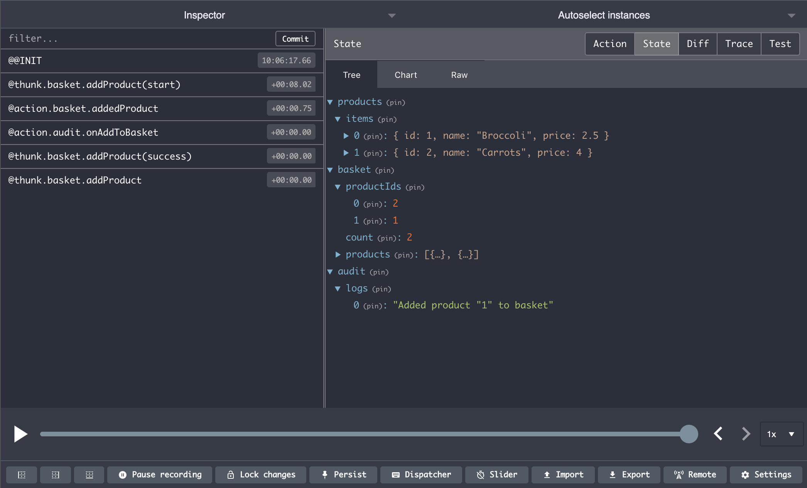

# Redux Dev Tools

We've completed all the feature updates to our application, however, before we sign off we'd like to introduce a very useful tool at debugging your application; the Redux Dev Tools extension.

Easy Peasy comes with out of the box support for the Redux Dev Tools extension. You simply need to ensure that you have it installed against your browser.

- [Redux Dev Tools for Chrome](https://chrome.google.com/webstore/detail/redux-devtools/lmhkpmbekcpmknklioeibfkpmmfibljd?hl=en)
- [Redux Dev Tools for Firefox](https://addons.mozilla.org/en-GB/firefox/addon/reduxdevtools/)

Once you have installed the extension, open your [application](https://codesandbox.io/s/easy-peasy-tutorial-listeners-rhni3), start the Redux Dev Tools extension and then perform an action, like adding a product to your basket. You will note that all the actions along with their effects on state will be visible within the extension.

This is an invaluable tool, especially as your global store scales in size and complexity.