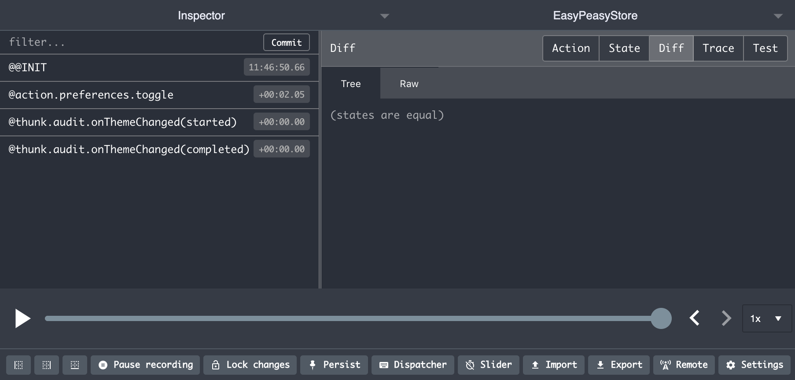

# Updating multiple state branches via a single action

There are cases where you may want to update multiple branches of your state in response to a single [action](/docs/api/action). For example, say you wanted to clear certain parts of your state when a user logged out, or perhaps you would like an audit log that tracks when specific [actions](/docs/api/action) are fired.

To support these use cases Easy Peasy allows you to declare an [action](/docs/api/action), or a [thunk](/docs/api/thunk), as being a *listener*. [Actions](/docs/api/action) and [thunks](/docs/api/thunk) both accept an additional configuration argument, which allows you to specify a *target* [action](/docs/api/action), or [thunk](/docs/api/thunk) to listen to. When the *target* has successfully dispatched and completed your *listener* will be dispatched, and it will receive the same payload as was provided to the *target*.

In the example below we will set up a *listener* that responds to todo items being added. The *listener* will then update an audit log.

```javascript
const todosModel = {
  items: [],
  // 👇 this is the target we wish to listen to
  addTodo: action((state, payload) => {
    state.items.push(payload)
  })
};

const auditModel = {
  logs: [],
  // 👇 and here we are configuring the listener
  onAddTodo: action(
    (state, payload) => {
      state.logs.push(`Added todo: ${payload.text}`);
    },
    { listenTo: todosModel.addTodo }
  )
};

const model = {
  todos: todosModel,
  audit: auditModel
};
```

Being able to declare *listeners* allows you to maintain clearer separation of concerns. It would be strange in our example above if the todos model had to dispatch an action against the audit model in order to ensure the logging occurs. It is not the todos model's responsibility to know about auditing. *Listeners* allow us to maintain the correct responsibilities.

## Debugging listeners

Listeners are visible within the [Redux Dev Tools](https://github.com/zalmoxisus/redux-devtools-extension) extension. This makes it very easy to validate they are executing as expected, and to see the effect that they had on state.

Below is an example where our *listener* is an [action](/docs/api/action) - i.e. performing state updates.


And here is an example where our *listener* is a [thunk](/docs/api/thunk) - i.e. performing side effects.


