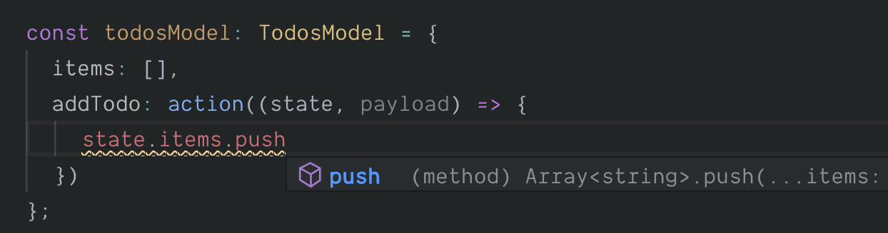
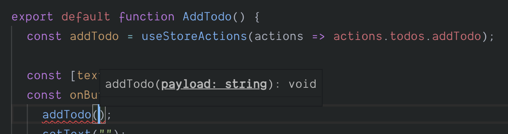

# Adding typed actions

Easy Peasy exports an `Action` type, allowing you declare an [action](/docs/api/action) against your model interface. The signature for this type is:

```typescript
type Action<
  Model extends Object = {}, 
  Payload = void
>
```

## Type parameters

As you can see it accepts 2 type parameters, with both being optional. These type parameters can be described as follows.

 - `Model`

   The model against which the action is being bound. This allows us to ensure the the `state` that is exposed to our [action](/docs/api/action) implementation is correctly typed.

- `Payload`

  If you expect the [action](/docs/api/action) implementation to receive a payload then you should provide the type for the payload. If your [action](/docs/api/action) will not receive any payload you can omit this type parameter.

## Declaring an Action

Let's define an [action](/docs/api/action) that will allow us to add a todo.

```typescript
import { Action } from 'easy-peasy'; // 👈 import the type

export interface TodosModel {
  items: string[];
  addTodo: Action<TodosModel, string>; // 👈 declaring our action
}
```

We have provided type parameter to our `Action` informing it that it is operating against the `TodosModel` and that it should expect a payload of type `string`.

## Implementing an Action

We can now implement this [action](/docs/api/action) against our model.

```typescript
import { action } from 'easy-peasy';

const todos: TodosModel = {
  items: [],
  addTodo: action((state, payload) => {
    state.items.push(payload);
  });
};
```

You will have noted that TypeScript was providing us with the typing information and assertions whilst we implemented our [action](/docs/api/action).

<div class="screenshot">
  
  <span class="caption">Typing info available during action implementation</span>
</div>

## Using an action

We can now consume the [action](/docs/api/action) within our components, whilst making sure that we use the typed `useStoreActions` that we exported from our [store](/docs/api/store).

```typescript
import { useStoreActions } from '../store'; // 👈 import typed hook

function AddTodo() {
  //                                  map the addTodo action 👇
  const addTodo = useStoreActions(actions => actions.todos.addTodo);

  const [text, setText] = useState('');
  const onButtonClick = useCallback(() => {
    addTodo(text); // 👈 dispatch our action with the text describing the todo
    setText('');
  }, [addTodo, setText, text]);

  return (
    <>
      <input text={text} onChange={e => setText(e.target.value)} type="text />
      <button onClick={onButtonClick}>Add Todo</button>
    </>
  );
}
```

<div class="screenshot">
  
  <span class="caption">Typing info available for action dispatch</span>
</div>

## Demo Application

You can view the progress of our demo application [here](https://codesandbox.io/s/easy-peasytypescript-tutorialtyped-actions-hf53f).
