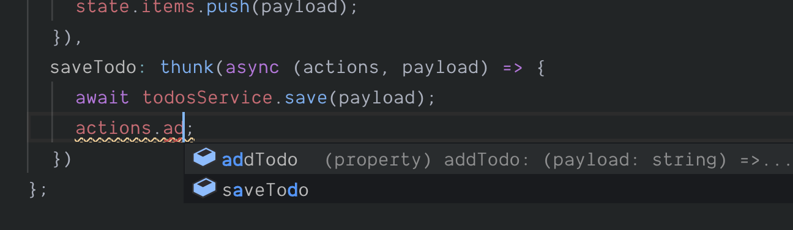
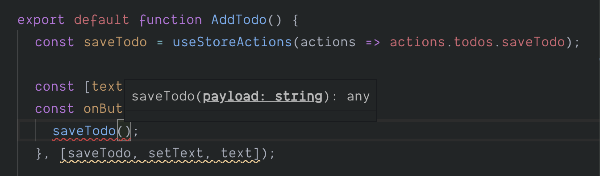

# Adding typed thunks

Easy Peasy exports a `Thunk` type, allowing you to declare a [thunk](/docs/api/thunk) against your model interface. The signature for this type is:

```typescript
type Thunk<
  Model extends Object = {},
  Payload = void,
  Injections = any,
  StoreModel extends Object = {},
  Result = any
>
```

## Type parameters

As you can see it accepts five type parameters, all of them optional. This may seem like a lot, but in most cases you will likely only need to provide two. We have tried to order the type parameters from the most to the least frequently used.

The type parameters can be described as follows.

- `Model`

  The model against which the [thunk](/docs/api/thunk) is being bound. This allows us to ensure the the `actions` argument that is provided to our [thunk](/docs/api/thunk) implementations are correctly typed.

- `Payload`

  If you expect the [thunk](/docs/api/thunk) to receive a payload then you should provide the type for the payload. If your [thunk](/docs/api/thunk) will not receive any payload you can omit this type parameter or set it to `void`.

- `Injections`

  When [creating your store](/docs/api/create-store) you can specify `injections` via the [store configuration](/docs/api/store-config). The typical use case for the `injections` is to provide a mechanism by which to dependency injected services used to make HTTP calls. These `injections` are exposed to your your [thunks](/docs/api/thunk) via the `helpers` argument that they receive.

  Should you be using injections then it is useful to provide the typing information that describes them to this type parameter.

- `StoreModel`

  The `helpers` argument to your [thunks](/docs/api/thunk) exposes APIs which allow you to get the entire store state (via `getStoreState`), or all the actions for your store (via `getStoreActions`).

  For these to be correctly typed we need to ensure that we provide the model interface for our store to this type parameter.

- `Result`

  If you return data from your [thunk](/docs/api/thunk), then you should provide the expected type here.

  A [thunk](/docs/api/thunk) always returns a `Promise`. By default it is of type `Promise<void>`, however, if you provide this type parameter it becomes `Promise<Result>`.

## Declaring a Thunk

Let's define a [thunk](/docs/api/thunk) which we will use to save a todo.

```typescript
import { Thunk } from 'easy-peasy';

export interface TodosModel {
  items: string[];
  addTodo: Action<TodosModel, string>;
  saveTodo: Thunk<TodosModel, string>; // 👈 declaring our thunk
}
```

As you can see our `Thunk` is operating against the `TodosModel` and it expects a payload of `string`.

## Implementing a Thunk

We can now implement this [thunk](/docs/api/thunk) against our model.

```typescript
import { thunk } from 'easy-peasy';

const todosModel: TodosModel = {
  items: [],
  addTodo: action((state, payload) => {
    state.items.push(payload);
  }),
  saveTodo: thunk(async (actions, payload) => {
    await todosService.save(payload); // imagine calling an HTTP service
    actions.addTodo(payload);
  })
};
```

You will have noted that TypeScript was providing us with the typing information and assertions whilst we implemented our [thunk](/docs/api/thunk).

<div class="screenshot">
  
  <span class="caption">Typing info available during thunk implementation</span>
</div>

## Using a thunk

We can now consume the [thunk](/docs/api/thunk) within our component, making sure we use the typed version of `useStoreActions` that we exported from our store. We will refactor our component from earlier.

```typescript
import { useStoreActions } from '../hooks'; // 👈 import typed hook

function AddTodo() {
  //                                    map the saveTodo thunk 👇
  const saveTodo = useStoreActions(actions => actions.todos.saveTodo);

  const [text, setText] = useState('');
  const onButtonClick = useCallback(() => {
    saveTodo(text) // 👈 dispatch our thunk with the text describing the todo
      .then(() => setText('')); // then chain off the promise returned by the thunk
  }, [addTodo, setText, text]);

  return (
    <>
      <input text={text} onChange={e => setText(e.target.value)} type="text />
      <button onClick={onButtonClick}>Add Todo</button>
    </>
  );
}
```

<div class="screenshot">
  
  <span class="caption">Typing info available during thunk dispatch</span>
</div>

## Demo Application

You can view the progress of our demo application [here](https://codesandbox.io/s/easy-peasytypescript-tutorialtyped-thunks-j4b3p)
