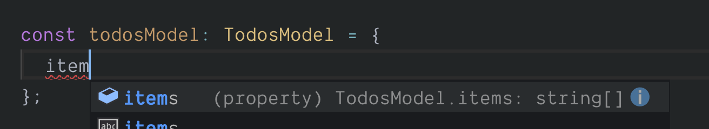
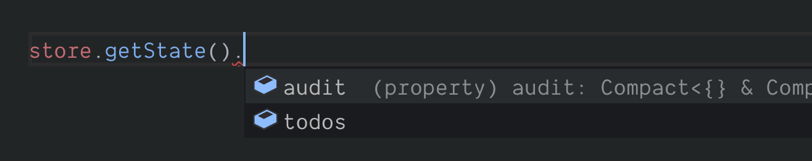

# Creating your store

The heart of the TypeScript integration with Easy Peasy are the typing definitions you define to represent your [store's](/docs/api/store) model. This typing information can then be used by the various Easy Peasy APIs to provide you with assertions, code completions, etc.

For this tutorial we will create a model consisting of two slices; todos and an audit log.

## Interface declaration

We will start by defining the state for our model - without actions/thunks/etc.

```typescript
// The interface representing our Todos model
interface TodosModel {
  items: string[];
}

// The interface representing our Audit model
interface AuditModel {
  log: string[];
}

// The interface representing our entire store model
interface StoreModel {
  todos: TodosModel;
  audit: AuditModel;
}
```

## Model implementation

Using our model interfaces we can create our model implementation.

```typescript
const todosModel: TodosModel = {
  items: []
};

const auditModel: AuditModel = {
  logs: []
};

const storeModel: StoreModel = {
  todos,
  audit
}
```

Good ol' TypeScript will make sure that we implement the model in full.

<div class="screenshot">
  
  <span class="caption">TypeScript powered model implementation</span>
</div>

## File structure

You can organise your model interfaces and implementations as you please. My personal preference is to split them out into seperate files based on slice/feature.

```typescript
// todos.ts

export interface TodosModel {
  items: Todo[];
}

const todosModel: TodosModel = {
  items: []
};

export default todosModel;
```

## Creating the store

Now that we have our model defined we can pass it to [createStore](/docs/api/create-store.html) in order to create our [store](/docs/api/store.html).

```typescript
import storeModel from './model';

const store = createStore(storeModel);
```

The [store](/docs/api/store.html) that is returned will be fully typed. If you try to use the [store's](/docs/api/store) APIs you will note the typing information and code completion being offered by your IDE.

<div class="screenshot">
  
  <span class="caption">Typed store APIs</span>
</div>

## Review

You can view the progress of our demo application [here](https://codesandbox.io/s/easy-peasytypescript-tutorialcreate-store-h7btv).
