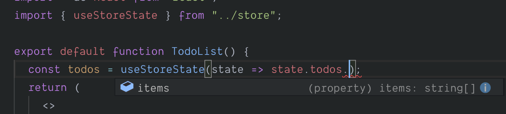

# Using typed hooks

If you import the Easy Peasy hooks directly you need to provide your model to them so that your stores typing is available within the mapping functions.

```typescript
import { useStoreState } from 'easy-peasy';
import { StoreModel } from '../model'; // 👈 you would need to do this

function MyComponent() {
  //            and then this 👇
  const foo = useStoreState<StoreModel>(state => state.foo);
}
```

That is slightly cumbersome, therefore for convenience sake, we expose a [createTypedHooks](/docs/api/create-typed-hooks.html) API which allows you to create versions of the hooks which are pre-bound within your StoreModel. Using the hooks returned by this API allows you to avoid having to provide your StoreModel every time you use one of the hooks.

We therefore recommend that you use the [createTypedHooks](/docs/api/create-typed-hooks.html) API to create typed hooks and then export them so that you can use them within your components.

## Exporting the typed hooks

The following example will demonstrate how we can create and export our typed hooks.

```typescript
// src/hooks.ts

import { createTypedHooks } from 'easy-peasy'; // 👈import the helper
import { StoreModel } from './model'; // 👈 import our model type

// Provide our model to the helper      👇
const typedHooks = createTypedHooks<StoreModel>();

// 👇 export the typed hooks
export const useStoreActions = typedHooks.useStoreActions;
export const useStoreDispatch = typedHooks.useStoreDispatch;
export const useStoreState = typedHooks.useStoreState;
```

## Using the typed hooks

We can now import the typed hooks into a component.

```typescript
import { useStoreState } from '../hooks'; // 👈 import the typed hook

function TodoList() {
  const todos = useStoreState(state => state.todos.items);
  return (
    <ul>
      {todos.map(todo => <li>{todo}</li>)}
    </ul>
  );
}
```

<div class="screenshot">
  
  <span class="caption">Typing info available on typed hook</span>
</div>

## Review

You can view the progress of our demo application [here](https://codesandbox.io/s/easy-peasytypescript-tutorialtyped-hooks-mzkp8).
