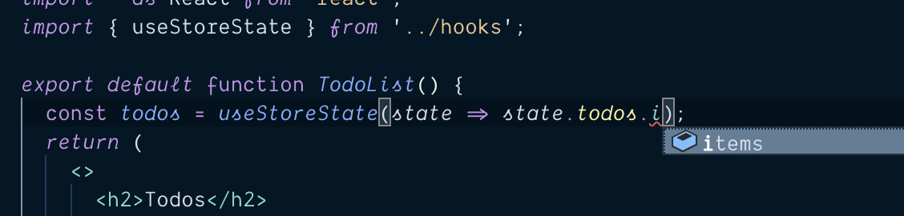

# Using typed hooks

If you import the Easy Peasy hooks directly you need to provide your model to them so that your stores typing is available within the mapping functions.

```typescript
import { useStoreState } from 'easy-peasy';
import { StoreModel } from '../store/model'; // 👈 you would need to do this

function MyComponent() {
  //            and then this 👇
  const foo = useStoreState<StoreModel>(state => state.foo);
}
```

That is slightly cumbersome, therefore for convenience sake, we bind typed versions of the hooks against every [store](/docs/api/store) instance. If you use the hooks bound to your [store](/docs/api/store) instance you wouldn't need to provide any model information.

We therefore recommend that you extract the typed hooks off your [store](/docs/api/store) instance and export them so that you can use them within your components.

## Exporting the typed hooks

The following example will demonstrate how we can extract and export our typed hooks.

```typescript
// store.ts

import { createStore } from 'easy-peasy';
import storeModel from './model';

const store = createStore(storeModel);

// 👇export the typed hooks
export const useStoreActions = store.useStoreActions;
export const useStoreDispatch = store.useStoreDispatch;
export const useStoreState = store.useStoreState;

export default store;
```

## Using the typed hooks

We can now import the typed hooks into a component.

```typescript
import { useStoreState } from '../store'; // 👈 import the typed hook

function TodoList() {
  const todos = useStoreState(state => state.todos.items);
  return (
    <ul>
      {todos.map(todo => <li>{todo}</li>)}
    </ul>
  );
}
```

<div class="screenshot">
  
  <span class="caption">Typing info available on typed hook</span>
</div>

## Alternative approach

There may be cases where extracting the hooks off your [store](/docs/api/store) instance may be inconvenient. For example, if you are using a factory function to create your store. 

An alternative approach would be to create typed versions of your hooks manually.

```typescript
// hooks.ts

import * as EasyPeasy from 'easy-peasy';
import { StoreModel } from './model';

export const useStoreActions = EasyPeasy.useStoreActions<StoreModel>;
export const useStoreDispatch = EasyPeasy.useStoreDispatch<StoreModel>;
export const useStoreState = EasyPeasy.useStoreState<StoreModel>;
```

## Demo Application

You can view the progress of our demo application [here](https://codesandbox.io/s/easy-peasytypescript-tutorialtyped-hooks-8jonb).
