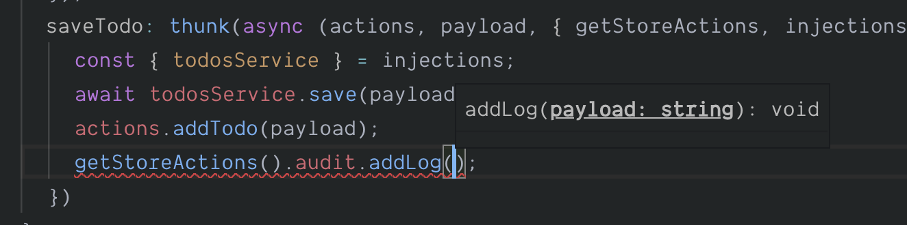

# Exposing entire store to our thunk

We will now extend our [thunk](/docs/api/thunk) so that it is able to get the state/actions for the entire [store](/docs/api/store), after which we will update our [thunk](/docs/api/thunk) implementation so that it will create an audit log entry every time a todo is saved.

## Extending our audit model with an action

Firstly, let's ensure that our audit model has an [action](/docs/api/action) on it which allows us to create a new log entry.

```typescript
interface AuditModel {
  log: string[];
  addLog: Action<AuditModel, string>;
}

const audit: AuditModel = {
  logs: [],
  addLog: action((state, payload) => {
    state.logs.push(payload)
  })
};
```

## Calling audit model from our todo model thunk

Now let's update our [thunk](/docs/api/thunk) configuration so that it is aware of the typings that represent our entire [store](/docs/api/store).

```typescript
import { StoreModel } from '../model';
//          👆 import the interface that represents our store model
//              don't worry about circular references, this is allowed

export interface TodosModel {
  items: string[];
  addTodo: Action<TodosModel, string>;
  saveTodo: Thunk<
    TodosModel,
    string,
    Injections,
    StoreModel // 👈 provide the store model interface
  >;
}
```

We can now refactor our [thunk](/docs/api/thunk) implementation to make use of the `getStoreActions` helper that is provided to it.

```typescript
const todosModel: TodosModel = {
  items: [],
  addTodo: action((state, payload) => {
    state.items.push(payload);
  }),
  saveTodo: thunk(async (actions, payload, { injections, getStoreActions }) => {
    const { todosService } = injections;
    await todosService.save(payload);
    actions.addTodo(payload);
    // 👇 accessing global actions
    getStoreActions().audit.addLog(`Added todo: ${payload}`);
  })
};
```

As you can see above we were able to get full type information against the `getStoreActions` helper, allowing us to add a log entry.

<div class="screenshot">
  
  <span class="caption">Typing info available on getStoreActions</span>
</div>

## Accessing global state from thunk

It is important to note that the `getStoreState` helper would work equally as well.

```typescript
thunk(async (actions, payload, { getStoreState }) => {
  console.log(getStoreState().audit.logs);
})
```

## Demo Application

You can view the progress of our demo application [here](https://codesandbox.io/s/easy-peasytypescript-tutorialtyped-thunk-global-870xx)