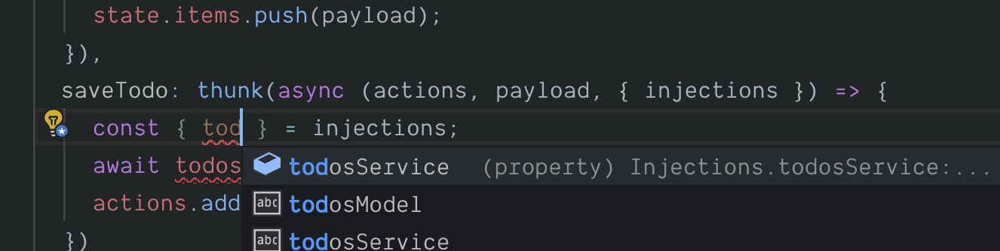

# Using typed injections

Let's refactor our [thunk](/docs/api/thunk.html) from earlier so that the `todosService` is injected via our [store](/docs/api/store.html).

## Defining interface for injections

Firstly, let's define an interface to represent our injections.

```typescript
// src/store/index.ts

import * as todosService from '../services/todos-service';

export interface Injections {
  todosService: typeof todosService;
}
```

## Injecting into store

Now, let's update the code used to create our [store](/docs/api/store.html).

```typescript
// src/store/index.ts

const store = createStore(model, {
  // 👇 provide injections to our store
  injections: { todosService }
});
```

## Typing injections on our thunk

Then we will update the [thunk](/docs/api/thunk.html) definition on our model interface.

```typescript
import { Injections } from '../store';
//          👆import the injections type

export interface TodosModel {
  items: string[];
  addTodo: Action<TodosModel, string>;
  saveTodo: Thunk<TodosModel, string, Injections>; // 👈 provide the type
}
```

## Refactoring thunk implementation to use injections

We can then refactor our [thunk](/docs/api/thunk.html) implementation.

```typescript
const todosModel: TodosModel = {
  items: [],
  addTodo: action((state, payload) => {
    state.items.push(payload);
  }),
  saveTodo: thunk(async (actions, payload, { injections }) => {
    const { todosService } = injections; // 👈 destructure the injections
    await todosService.save(payload);
    actions.addTodo(payload);
  })
};
```

Again you should have noted all the typing information being available.

<div class="screenshot">
  
  <span class="caption">Typing info available using injections</span>
</div>

## Demo Application

You can view the progress of our demo application [here](https://codesandbox.io/s/easy-peasytypescript-tutorialtyped-injections-fgeqk)